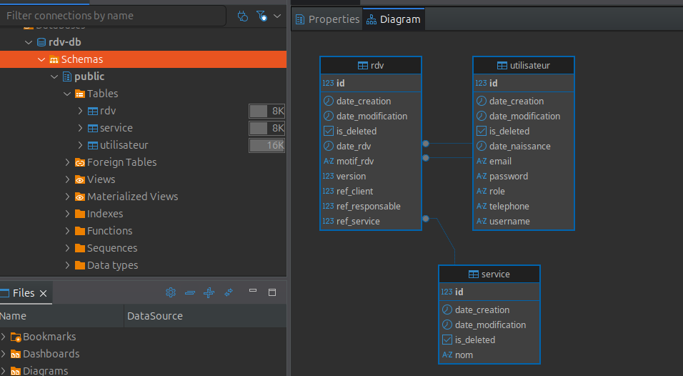
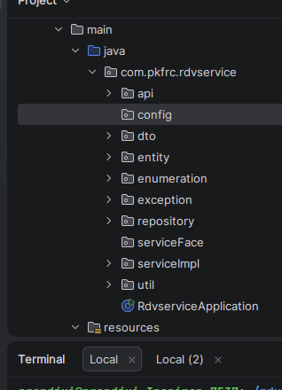

# RDV Service - Application de Gestion de Rendez-vous

## Description

Application Spring Boot 4.0.0 pour la gestion de rendez-vous avec support de PostgreSQL, validation des conflits, et gestion de concurrence.

## Technologies Utilisées

* Java 21 - Langage principal 
* Spring Boot 4.0.0 - Framework 
* PostgreSQL 16 - Base de données 
* Spring Data JPA - ORM 
* Lombok - Réduction du code boilerplate 
* Maven - Gestion des dépendances 
* Testcontainers - Tests d'intégration 
* JUnit 5 & Mockito - Tests unitaires

 # 1. Installation et lancement

git clone https://github.com/NGANDJUI23/rdvservice.git

cd rdvservice

# 2. Compiler et lancer

Vous devez avoir Docker installe sur votre ordinateur
    
    mvn clean install    
    mvn test

# 3. Differentes API

    ## Gestion des Utilisateurs /api/utilisateurs
    ## Gestion des Rendez-vous /api/rendez-vous
    ## Gestion des Services /api/services
# 4. Esquisse de la BD

# 5. Architecture du code

# 3. Test Technique

### Tests repository
    mvn test -Dtest=*RepositoryTest

### Tests service
    mvn test -Dtest=*ServiceImplTest

### Tests API
    mvn test -Dtest=*ApiTest

### Test spécifique 
 #### (ex: UtilisateurRepositoryTest)
    mvn test -Dtest=UtilisateurRepositoryTest

# 4. Accéder à l'application en locale
   
    API REST : http://localhost:8080

    Swagger UI : http://localhost:8080/swagger-ui.html

# 5. Accéder à l'application en production (sur l'instance Amazone EC2)
    
    API REST : http://34.205.247.223:8081
    
    Swagger UI : http://34.205.247.223:8081/swagger-ui.html
    
